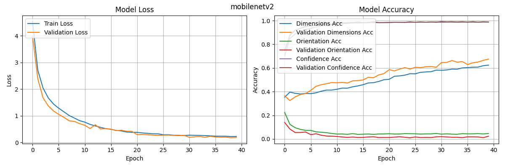

# YOLOv8-3D
## Description:

YOLOv8-3D is a lightweight and user-friendly library designed for efficient 2D and 3D bounding box object detection in Advanced Driver Assistance Systems (ADAS). With its intuitive API and comprehensive features, EasyADAS makes it straightforward to integrate object detection capabilities into your ADAS projects.

<div align="center">
<p>

This API supports for easy understanding and integrate 3D perception, systems can make more informed decisions and operate effectively in complex, real-world environments.
</p>
<br>
</div>


### Key Features:

- Simplified API: YOLOv8-3D provides a straightforward API that allows you to quickly implement object detection in your ADAS system.
- 2D and 3D Bounding Boxes: Detect both 2D and 3D bounding boxes for accurate spatial understanding of objects.
- Efficient Processing: Leverage optimized algorithms for fast and reliable object detection performance.
- Flexible Integration: EasyADAS is designed to seamlessly integrate with existing ADAS systems and frameworks.
- Comprehensive Documentation: Extensive documentation and examples ensure that you can get started quickly and easily.
- Scalable: Scale your detection capabilities by leveraging EasyADAS in a variety of scenarios and environments.
- supports all best and and state of the art CNN models and easy training setup.
- added augmentations for 3d .
- api supports Resnets, VGG nets, mobilenets, Efficientnets 

## special features

<div align="center">
     
<p>
  augmentations for better training, automated backup training and  results plot
</p>
</div>

## Get started

### Prerequisites

- Python 3.x (tested on 3.10, Ubuntu 22.04)
- OpenCV
- Tensorflow
- PyTorch
- NumPy
- KITTI 3d dataset [download from here](https://www.cvlibs.net/datasets/kitti/eval_object.php?obj_benchmark=3d)


### Usage

### Installation

1. Clone this repository.
2. Install the required dependencies


### Run
#### for training

```
####### select model on train.py  ########
# select_model = 'resnet50'
# select_model ='resnet101'
# select_model = 'resnet152'
# select_model = 'vgg11'
# select_model = 'vgg16'
# select_model = 'vgg19'
# select_model = 'efficientnetb0'
# select_model = 'efficientnetb5'
select_model = 'mobilenetv2'
```


```bash
conda create -n test1 python=3.10 -y
conda activate test1
pip install tensorflow
```
For more detailed tensorflow gpu installation instructions and options, refer to [this documentation](https://www.tensorflow.org/install).

```bash
###[INFO] set num of iterations to run (train.py) on (run_train.sh) file /// this automatically saves training info for every 20 epochs.
bash run_train.sh
```
recommended new environment to infer models only on cpu 
#### for testing
```bash
conda create -n test2 python=3.10 -y
conda activate test2
pip install tensorflow ultralytics
```

```bash
python demo.py
```


### Contributing

Contributions are welcome! If you find any issues or have suggestions for improvements, please open an issue or submit a pull request.


### Acknowledgements

<details><summary> <b>Expand</b> </summary>

* [https://github.com/AlexeyAB/darknet](https://github.com/AlexeyAB/darknet)
* [https://github.com/WongKinYiu/yolor](https://github.com/WongKinYiu/yolor)
* [https://github.com/WongKinYiu/PyTorch_YOLOv4](https://github.com/WongKinYiu/PyTorch_YOLOv4)
* [https://github.com/WongKinYiu/ScaledYOLOv4](https://github.com/WongKinYiu/ScaledYOLOv4)
* [https://github.com/Megvii-BaseDetection/YOLOX](https://github.com/Megvii-BaseDetection/YOLOX)
* [https://github.com/ultralytics/yolov3](https://github.com/ultralytics/yolov3)
* [https://github.com/ultralytics/yolov5](https://github.com/ultralytics/yolov5)
* [https://github.com/DingXiaoH/RepVGG](https://github.com/DingXiaoH/RepVGG)
* [https://github.com/JUGGHM/OREPA_CVPR2022](https://github.com/JUGGHM/OREPA_CVPR2022)
* [https://github.com/TexasInstruments/edgeai-yolov5/tree/yolo-pose](https://github.com/TexasInstruments/edgeai-yolov5/tree/yolo-pose)
* [https://www.cvlibs.net/datasets/kitti/eval_object.php?obj_benchmark=3d](https://www.cvlibs.net/datasets/kitti/eval_object.php?obj_benchmark=3d)
* [https://opencv.org/](https://opencv.org/)
* [https://github.com/ultralytics/ultralytics](https://github.com/ultralytics/ultralytics)
* [https://github.com/lzccccc/3d-bounding-box-estimation-for-autonomous-driving](https://github.com/lzccccc/3d-bounding-box-estimation-for-autonomous-driving)
* [https://github.com/lzccccc/SMOKE](https://github.com/lzccccc/SMOKE)
* [https://github.com/abhi1kumar/DEVIANT.git](https://github.com/abhi1kumar/DEVIANT.git)

</details>
  
